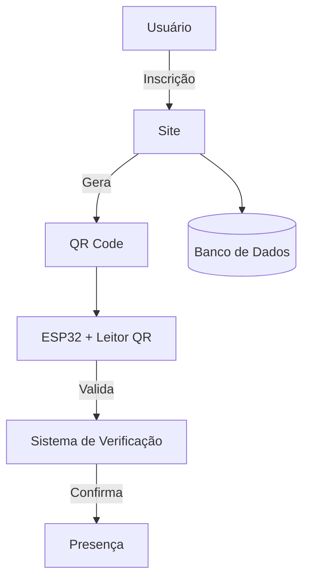

# ⚽ Sprint 3 - EDGE  
### Projeto: Sistema de Registro em Peneira de Futebol com ESP32 e QR Code  

---

## 👥 Integrantes
- **Henrique Keigo Nakashima Minowa** – RM: 564091  
- **Eduardo Delorenzo Moraes** – RM: 561749  
- **Matheus Bispo Faria Barbosa** – RM: 562140  

---

## 📌 Descrição do Projeto
O projeto tem como objetivo **modernizar e agilizar o processo de registro de presença em peneiras de futebol**.  

- O sistema integra um **site de inscrição** com um **dispositivo IoT (ESP32)** equipado com um **leitor de QR Code**.  
- Durante a inscrição, o jogador recebe um **QR Code único**, vinculado ao banco de dados.  
- No dia da peneira, o **ESP32 lê o QR Code** e envia os dados para validação em tempo real.  
- O sistema confirma a inscrição e registra a presença.  

✅ Mais rapidez  
✅ Maior segurança  
✅ Melhor organização  

---

## 🏗️ Arquitetura Proposta

## 🔎 Funcionamento
O jogador realiza a inscrição no site.

O sistema gera e envia um QR Code único para o participante.

No evento, o jogador apresenta o QR Code.

O ESP32 com leitor de QR Code captura o código.

O ESP32 envia os dados para o sistema/banco de dados.

O sistema valida e confirma a presença automaticamente.

## 🛠️ Recursos Necessários
## 📡 Hardware

ESP32

Módulo leitor de QR Code

Acesso Wi-Fi

## 💻 Software/Plataforma

Site de inscrição (Frontend + Backend)

Banco de dados (ex: MySQL, Firebase)

Código-fonte para ESP32 (C++ / Python)

Scripts de integração com sistema de verificação

## 🚀 Instruções de Uso

O usuário realiza a inscrição no site e recebe o QR Code.

No evento, apresenta o QR Code no ponto de registro.

O ESP32 lê e envia os dados para o sistema.

Se válido, a presença é confirmada automaticamente.

👉 Link do Vídeo Explicativo [Sprint3 Edge](https://youtu.be/Kbr5rljgnfE?si=yGvHJqcRbJOsZDLU)
